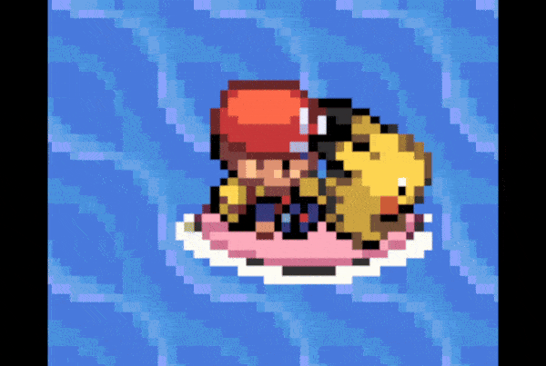
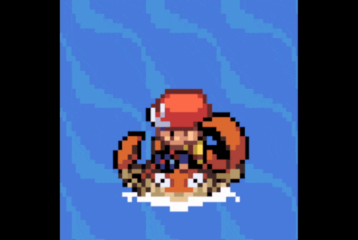

# Dynamic surfing overworlds for FR
## Expansion by Shiny miner, ansh

**Original thread (by ghoulslash):**
https://www.pokecommunity.com/threads/fire-red-dynamic-surf-overworlds.420665/

For any queries, ping one of us via [Discord](https://discord.gg/yKhCRrqJyX):
- anxz86
- jordank.memes
- shinyhunter08

## What Is This?

This is a feature, originally from pokeem, (see https://github.com/Slawter666/pokeemerald/tree/surfable/src), to have the surfing sprite dynamically change based on the first party pokemon or selected pokemon from the menu.



## Improved Features

1. One master structure for all species data, so worrying about matching indexes is no longer an issue

2. The palette is directly loaded from an address rather than using a tag. A tag is still needed for tracking the palette, but there is no need to add the palette to the NPC palette table. This means you only need one tag for all surf sprites, since only one will exist at the same time.

3. Switching Pokemon mid-surf will not change the surf blob

4. Selecting a Pokemon from the pokemenu loads the correct graphics

5. The overlay frames are hidden underneath map tiles (eg. treetops over water)

### Special Sprite Handling

This repo also now supports unique West/Left-facing and East/Right-facing sprites!
In the case of Kingler, it has an asymmetric sprite, with one larger claw. Mirroring this sprite would have resulted in the claw switching sides when the player moves around; instead, we now support sprites that have a unique look for all 4 directions!



## Important Notes

1. This includes the dynamic overworld palette hack, as it removes the need to worry about matching palettes, and is generally just awesome. See https://github.com/Navenatox/DynamicOverworldPalettes for more details. The original source code has been modified to call some of these functions, so removing the file if you've already added this feature will not do. There is ample free-space in FR so I suggest just leaving it be unless you know what you are doing.

2. This feauture is currently missing a lot of necessary artwork. Any pokemon without art will default to the original surf blob. As art is added, either by the user or community, you can change this in src/surf_mons.h by changing the elements `.paletteTag` and `.images` of `const struct SpriteTemplate s[species]Overworld`

3. Fire Red likes vertical images, and as such the sprites have to have all their frames lined up vertically, as opposed to the pokeem images that are layered horizontally. While annoying, changing the frame ordering isn't a big deal, and I hope this won't stand in the way of community art being shared.


## TODOs:

1. Verify that each Pokemon has a matching Shiny sprite

2. Try to identify any missing credits via pokecommunity thread (or old repo), if possible

3. Add Zangoose, Surskit, Masquerain as tradebacks

4. Test all sprites in-engine (see Tha Code Mining Hub's #surf-overworlds-expansion channel, and "Checking in-game" thread)

5. Apply fixes from #5.

---

# Completed Pokemon
## Spriting Progress:
### Gen 1: 100%
- Squirtle - Complete (emme97)
- Wartortle - Complete (Avara)
- Blastoise - Complete (emme97)
- Pikachu - Complete (Nolo33LP, with some centering by Ansh746)
- Raichu - Complete (Nolo33LP)
- Nidoqueen - Complete
- Nidoking  - Complete
- Psyduck - Complete (ghoulslash)
- Golduck - Complete (ghoulslash)
- Poliwag - Complete
- Poliwhirl  - Complete
- Poliwrath  - Complete
- Tentacool - Complete (Avara)
- Tentacruel - Complete (Avara)
- Slowpoke - Complete (ghoulslash)
- Slowbro - Complete (ghoulslash)
- Seel - Complete (ghoulslash)
- Dewgong - Complete (ghoulslash)
- Shellder - Complete
- Cloyster - Complete
- Krabby  - Complete
- Kingler - Complete (Ansh746)
- Lickitung - Complete
- Rhydon - Complete
- Kangaskhan - Complete
- Horsea  - Complete
- Seadra - Complete
- Goldeen - Complete
- Seaking - Complete
- Staryu - Complete (ghoulslash)
- Starmie - Complete (ghoulslash)
- Tauros - Complete
- Gyarados  - Complete
- Lapras - Complete (Slawter666)
- Vaporeon - Complete (ghoulslash)
- Omanyte - Complete
- Omastar - Complete
- Kabuto - Complete
- Kabutops - Complete
- Snorlax - Complete
- Dratini - Complete (michelle soto)
- Dragonair - Complete
- Dragonite - Complete
- Mew - Complete

### Gen 2: 100%
- Totodile - Complete
- Croconaw - Complete
- Feraligatr - Complete
- Sentret - Complete (gota_csm)
- Furret - Complete (gota_csm)
- Pichu - Complete (Nolo33LP)
- Chinchou - Complete
- Lanturn - Complete
- Marill - Complete
- Azumarill - Complete (Shiny)
- Politoed - Complete
- Wooper - Complete
- Quagsire - Complete
- Slowking - Complete (ghoulslash)
- Qwilfish - Complete
- Sneasel - Complete
- Corsola - Complete
- Remoraid - Complete
- Octillery - Complete
- Mantine - Complete
- Kingdra - Complete
- Miltank - Complete
- Suicune - Complete
- Tyranitar - Complete
- Lugia - Complete

### Gen 3: 89%
- Mudkip - Complete
- Marshtomp - Complete
- Swampert - Complete (Zhyruk)
- Zigzagoon - Complete
- Linoone - Complete
- Lotad - Complete
- Lombre - Complete
- Ludicolo - Complete
- Pelipper - Complete
- Makuhita - Complete
- Hariyama - Complete
- Azurill - Complete
- Aggron - Complete
- Carvanha - [Complete?] Michelle Soto, w/ edits by Jordank
- Sharpedo - Complete (Pokets)
- Wailmer - Complete (Hestia)
- Wailord - Complete (Pokets)
- Barboach - Complete (Pokets)
- Whiscash - Complete (EduarPokeN)
- Corphish - Complete (EduarPokeN)
- Crawdaunt - Complete (EduarPokeN)
- Feebas - Missing
- Milotic - Complete
- Spheal - Complete (ghoulslash)
- Sealeo - Complete (ghoulslash)
- Walrein - Complete (ghoulslash)
- Clamperl - Complete (Nolo33LP)
- Huntail - Complete (Nolo33LP)
- Gorebyss - Complete (Nolo33LP)
- Relicanth - Complete (Pokets)
- Luvdisc - Missing
- Latias - Complete (Nolo33LP)
- Latios - Complete (Nolo33LP)
- Kyogre - Complete
- Rayquaza - Complete (Nolo33LP)

## Tradebacks (Receives Surf in a later gen)
### Gen 4: 100%
- Exploud - Complete

### Gen 9: 0%
- Surskit - Missing
- Masquerain - Missing
- Zangoose - Missing

## Pokemon w/ Gen 4-9 Evolutions
### Gen 4: 0%
- Munchlax - Missing
- Mantyke - Missing
- Lickilicky - Missing
- Rhyperior - Missing
- Weavile - Missing

## Pokemon w/ Regional Variants and Evolutions
### Alola: 0%
- Alolan Raichu - Missing

### Galar: 0%
- Galarian Slowpoke - Missing
- Galarian Slowbro - Missing
- Galarian Slowking - Missing
- Galarian Corsola - Missing
- Cursola - Missing
- Galarian Zigzagoon - Missing
- Galarian Linoone - Missing
- Obstagoon - Missing

### Hisui: 0%
- Hisuian Qwilfish - Missing
- Overqwil - Missing

### Paldea: 0%
- Paldean Tauros (Combat Breed) - Missing
- Paldean Tauros (Aqua Breed) - Missing
- Paldean Wooper - Missing
- Clodsire - Missing

---

## How To Compile:

1. add `rom.gba` to the main directory

2. open `scripts/make.py` and modify `OFFSET_TO_PUT` to wherever you'd like to insert this code, as well as `SEARCH_FREE_SPACE` to `True` if you'd like to search for free space from said offset.

3a. download devkitPro. see this tutorial for more information: https://www.pokecommunity.com/showpost.php?p=8825585&postcount=96

3b. download python 3.7.2 (make sure `add to path` is checked), then type `python scripts/make.py` into the terminal to compile the code and images.

4. `test.gba` will be added to the folder, and the offsets will be located in `offsets.ini`

---

### Adding New Species:

If you want to add new species that can learn surf, follow these steps. I will use Popplio as an example
1. make the sprite, 32 x 384 (12 frames of 32x32). Use the existing sprites as models.

2a. add the indexed image .png file to graphics/. Eg. `popplio.png`

2b. modify the palette of said image for the sprite's shiny colors, then place this image in graphics/shiny, eg. `popplioShiny.png`. Only the palette will get inserted into the rom, so make sure it can be applied to the original image without messing up the appearance.

3. add the following to surf_mons.h
```
extern const u32 popplioTiles[];
extern const u16 popplioPal[];
extern const u16 popplioShinyPal[];

const struct SpriteFrameImage gSurfingOverworldPicTable_Popplio[] = {
    overworld_frame(&popplioTiles[0], 4, 4, 0),
    overworld_frame(&popplioTiles[0], 4, 4, 1),
    overworld_frame(&popplioTiles[0], 4, 4, 2),
    overworld_frame(&popplioTiles[0], 4, 4, 3),
    overworld_frame(&popplioTiles[0], 4, 4, 4),
    overworld_frame(&popplioTiles[0], 4, 4, 5),
};

const struct SpriteFrameImage gSurfingOverlayPicTable_Popplio[] = {
    overworld_frame(&popplioTiles[0], 4, 4, 6),
    overworld_frame(&popplioTiles[0], 4, 4, 7),
    overworld_frame(&popplioTiles[0], 4, 4, 8),
    overworld_frame(&popplioTiles[0], 4, 4, 9),
    overworld_frame(&popplioTiles[0], 4, 4, 10),
    overworld_frame(&popplioTiles[0], 4, 4, 11),
};

const struct SpriteTemplate sPopplioOverworld = surf_template(PAL_TAG_SURF_NEW, gSurfingOverworldPicTable_Popplio, UpdateSurfBlobFieldEffect);
const struct SpriteTemplate sPopplioOverlay = surf_template(PAL_TAG_SURF_NEW, gSurfingOverlayPicTable_Popplio, UpdateSurfMonOverlay);
```

4. If you do not have any overlay frames, the sprite sheet only needs to be 32x192 (6 frames), and do not need to define the `OverlayPicTable`. Also, if you want unique palette tags, `PAL_TAG_SURF_NEW` should be `PAL_TAG_POPPLIO_SURF` or whatever you want to call it, instead.

5. Finally, add the following to the `gSurfablePokemon` structure at the bottom of the page. Note that I changed the structures from the pokeemerald source so you shouldn't have to worry about matching indices, since there is one main structure that defines the surfable pokemon
```
{
  .species = SPECIES_POPPLIO,
  .palAddr = &popplioPal[0],
  .shinyPalAddr = &popplioShinyPal[0],	// or 0 if it doesn't exist
  .overworldGfx = &sPopplioOverworld,
  .overlayGfx = &sPopplioOverlay,	// or 0 if it doesn't exist
},
```
